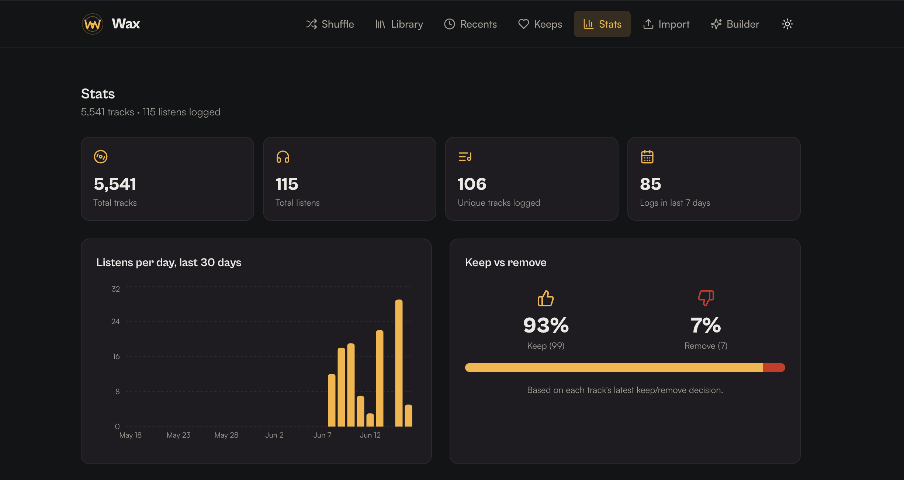
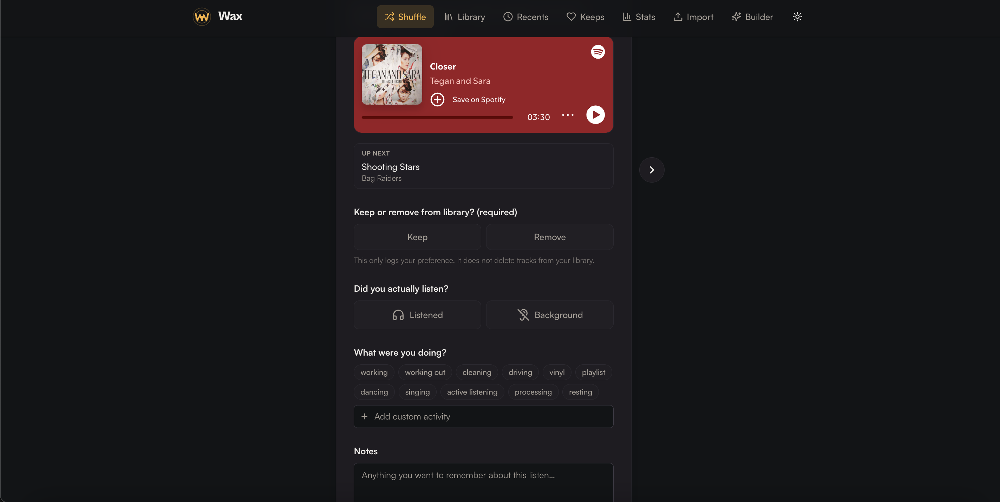
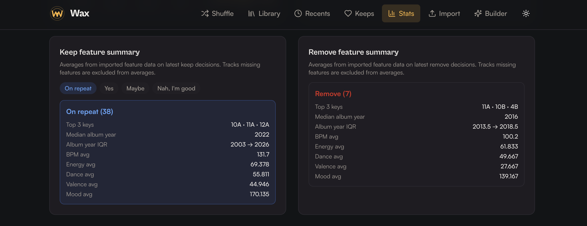

# Wax

A listening journal for your music library. Upload, shuffle, log your recent plays, and track your decisions to keep or remove tracks from your library. For songs you keep, you can decide how frequently you want to hear them again. These decisions will be weighted in the shuffle algorithm and in playlist generation.

## Introduction

Wax is a local-first listening journal for your music library. Upload your Spotify export (`.db`, `.sqlite`, or Exportify `.csv`), shuffle through your tracks, and log what you actually played, what you were doing, how it felt, and whether you'd play it again. Built to help you stop streaming past your library and start curating it.

For kept songs, you can set a repeat-intent category: *on repeat*, *yes*, *maybe*, or *nah I'm good*. These categories power weighted shuffle and playlist generation.

Wax also tracks core music features for stats and recommendations: BPM, key (Camelot), valence, dance, and energy. Mood score is a cumulative score out of 300 (`valence + dance + energy`, each on a 0-100 scale), and harmonic key flow uses the Camelot wheel so key movement stays DJ-friendly.

## Screenshots

### Dashboard stats



### Shuffle view



### Keep/remove stats



## Quick start

```bash
git clone https://github.com/kaseymallette/wax.git
cd wax
npm install
npm run dev
```

Open **http://localhost:3000**. Express backend and Vite frontend both run on the same port. (Port 5000 conflicts with macOS AirPlay — that's why the default is 3000.)

For full-song playback in the embed, sign into Spotify in any tab of the same browser. Premium plays the whole track; Free gives you 30-second previews.

## Back up your data

`data.db` is your local listening history and is not tracked in git. You can back it up and restore it with:

```bash
npm run backup-db   # creates backups/data.db.<timestamp>.bak
npm run restore-db  # restores latest backup in backups/
```

## Track decisions per user

`decisions-latest.json` files are tracked in git for each user. You can export and import your latest keep/remove decisions with:

```bash
WAX_USER=kasey npm run decisions:export  # writes users/kasey/decisions-latest.json
WAX_USER=kasey npm run decisions:import  # reapplies that file into local data.db
```

This snapshot stores one latest decision per track (`keep_in_library` + `repeat_intent`) so you can reimport your library and restore your curation quickly.

Use a different `WAX_USER` value per family member (for example: `mom`, `dad`, `kasey`) so each person has their own tracked decisions file under `users/`.

### Reimport library + restore decisions

If you want a clean reimport (no duplicate old imports/listens), do this:

1. Stop the app.
2. Remove your local DB files:

```bash
rm data.db data.db-wal data.db-shm 2>/dev/null || true
```

3. Start the app again:

```bash
npm run dev
```

4. Reimport your library in the UI.
5. Reapply your decisions snapshot:

```bash
WAX_USER=kasey npm run decisions:import
```

This restores each track's latest keep/remove + repeat-intent decision. It does not restore full listen history, notes, or activity timeline.


## How it works

1. **Import** — drop your `.db`, `.sqlite`, or `.csv` file on the import page. SQLite uploads use a column mapper (Track ID is the only required field; the rest auto-detects). CSV uploads auto-detect Exportify's standard columns.
2. **Shuffle** — get a random track from your library, listen, and log it. Each entry captures:
   - **Listened** — did you actually play it through?
   - **Keep in library** — keep / remove (logged preference only; does not delete)
   - **Hear again (Keep only)** — `on_repeat`, `yes`, `maybe`, `nah`
   - **Activity tags** — what you were doing (working, working out, cleaning, driving, dancing, singing, active listening, processing, resting, or custom)
   - **Notes** — free text
3. **Keeps** — keep-only view with repeat-intent filters and inline intent updates.
4. **Library** — searchable table of every track with listen count and last listened. Click any row to play it, log a new entry, edit repeat intent, or view full history.
5. **Recents** — timeline of every entry, grouped by day, with keep/remove and repeat-intent context.
6. **Stats** — listens over time, keep vs remove, and feature summaries for keeps and removes (including top keys and album-year metrics).

### Repeat-intent presets

Current repeat-intent presets are:

- `on_repeat`
- `yes`
- `maybe`
- `nah`

Want to change these labels/options?

- Edit `shared/schema.ts`
- Find `REPEAT_INTENT_OPTIONS`
- Update entries in this shape: `{ value: "my_value", label: "My Label" }`
- Keep `value` lowercase/slug-style (saved data), and `label` human-friendly (UI)

## Data model

Three core tables in `data.db`:

- **`tracks`** — your imported library. One row per Spotify track ID. Includes `repeat_intent` (track-level keep preference tag).
- **`listens`** — your log entries. One row per logged listen. Columns include `listened` (0/1), `want_again` (0/1), `would_again` (0/1), `keep_in_library` (0/1), `activity` (JSON array), `notes`, `logged_at` (unix ms).
- **`track_features`** — imported audio/music features keyed by track ID (`bpm`, `camelot`, `energy`, `dance`, `valence`, `popularity`, `album_year`, `source`, `updated_at`).

Indexes on `listens(track_id)` and `listens(logged_at DESC)`.

## Where your data lives

- **`data.db`** in the project root. Back this file up if you care about it.

- CSV export from the API gives you everything in one file:

```bash
curl http://localhost:3000/api/export -o ~/Downloads/wax-listens.csv
```

Columns include: `track_id`, `name`, `artists`, `album`, `repeat_intent`, `listened`, `want_again`, `would_again`, `keep_in_library`, `activity`, `notes`, `logged_at`.

## Reading your data from Python

```python
import sqlite3, json, pandas as pd

con = sqlite3.connect("wax/data.db")
df = pd.read_sql_query("""
    SELECT t.id AS track_id, t.name, t.artists, t.album, t.repeat_intent,
           l.listened, l.want_again, l.would_again, l.keep_in_library,
           l.activity, l.notes, l.logged_at
    FROM tracks t
    LEFT JOIN listens l ON l.track_id = t.id
    ORDER BY l.logged_at DESC
""", con)
df["activity"] = df["activity"].apply(lambda s: json.loads(s) if s else [])
df["logged_at"] = pd.to_datetime(df["logged_at"], unit="ms")
```

## Production build (optional)

```bash
npm run build                              # outputs dist/
NODE_ENV=production PORT=3000 node dist/index.cjs
```

## Troubleshooting

- **Port already in use** → `lsof -ti:3000 | xargs kill` then restart. Or run on a different port: `PORT=4000 npm run dev`.
- **macOS AirPlay grabbing port 5000** → use `PORT=3000` (default) or disable AirPlay Receiver in System Settings → General → AirDrop & Handoff.
- **`better-sqlite3` install fails** → needs a C++ toolchain. macOS: `xcode-select --install`. Ubuntu: `sudo apt install build-essential python3`. Node 22+ is recommended; Node 26 has no prebuilt binaries yet.
- **Old UI shows after pulling new code** → Vite cache: `rm -rf node_modules/.vite dist && npm run dev`, then hard-refresh the browser (Cmd+Shift+R).
- **Tracks show as "Unknown track" after CSV import** → your CSV's name column wasn't auto-detected. Wax recognizes `Song`, `Title`, `Track`, `Track Name`, `Song Name`. Rename your column or open an issue.
- **Lost data after rebuild** → `data.db` lives at the project root, not in `dist/`. Don't delete it.

## Tech stack

Express · Vite · React · TypeScript · Tailwind · shadcn/ui · Drizzle ORM · better-sqlite3 · TanStack Query · framer-motion · Recharts · Fontshare (Cabinet Grotesk + Satoshi).

## License

MIT
