# Wax

A local-first listening journal for your music library. Upload tracks, shuffle with intent, tag what to keep, and generate export-ready playlists you can push to Spotify.

## Introduction

Wax is built for deliberate curation instead of endless skipping. Import your library (`.db`, `.sqlite`, or Exportify `.csv`), run Shuffle, and log decisions quickly with keep/remove plus repeat intent.

Tracks start as *Undecided*, and keeps are organized into five intent buckets: *Currently Listening*, *Save for Later*, *Off the Rotation*, *Favorites Archive*, and *Skip for Now*. These intents drive weighted shuffle, Keeps/Stats views, and playlist generation.

The default playlist flow creates 7 daily playlists from *Currently Listening* (BPM + mood clustering, dynamic per-playlist cap tiers from 5 up to 30 tracks), plus one playlist each for *Currently Listening* (all tracks), *Save for Later*, and *Favorites Archive*. Everything exports to CSV first, then can be pushed to Spotify with the built-in push script.

Wax also tracks core audio features for analysis and ordering: BPM, key (Camelot), energy, dance, and valence. Mood score is `energy + dance + valence` on a 0–300 scale.

## Screenshots

### 01. Dev setup + launch

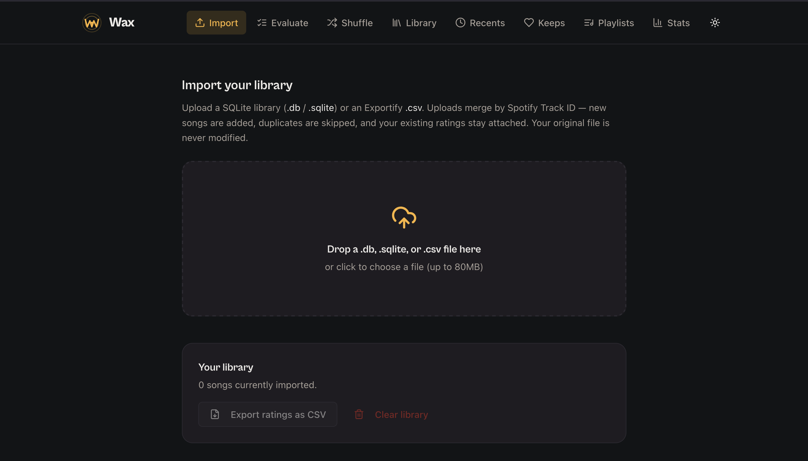

### 02. Import library source

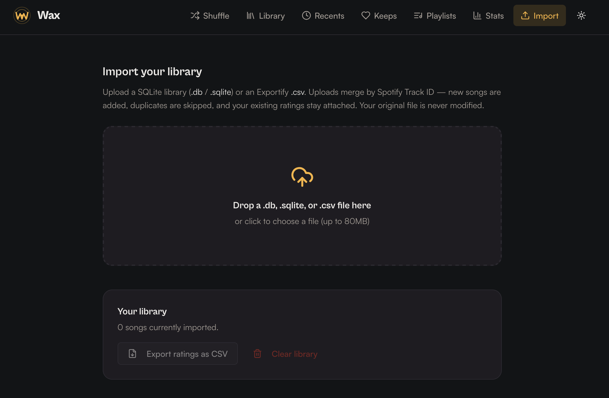

### 03. Map import columns

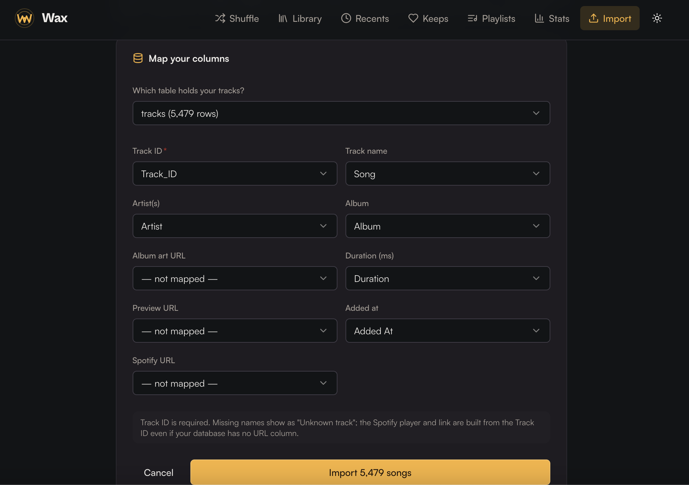

### 04. Import confirmation

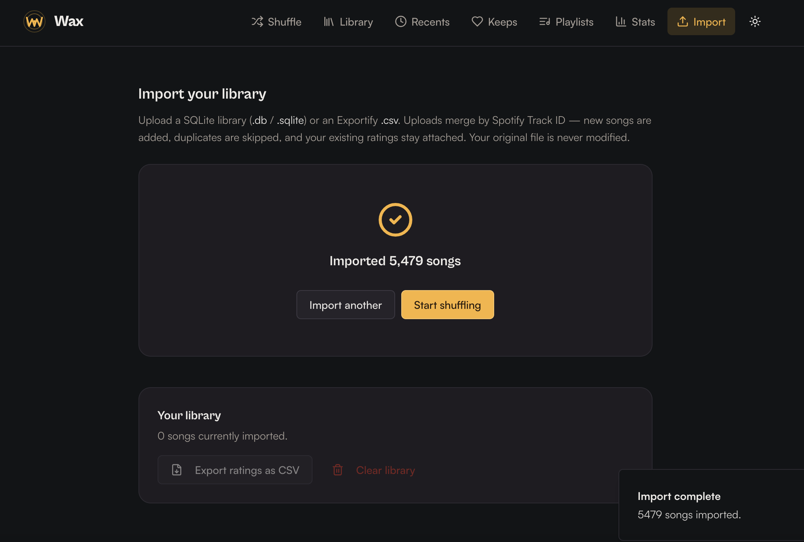

### 05. Shuffle

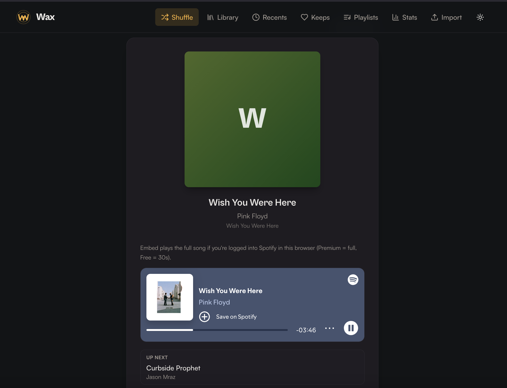

### 06. Keep Workflow

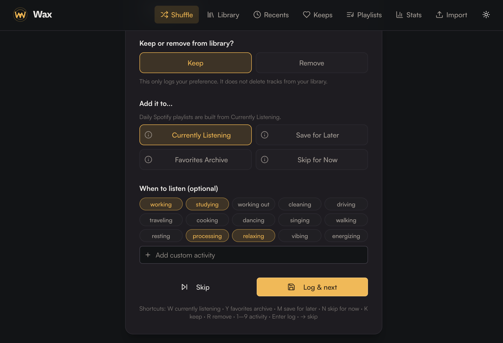

### 07. Library search + browse

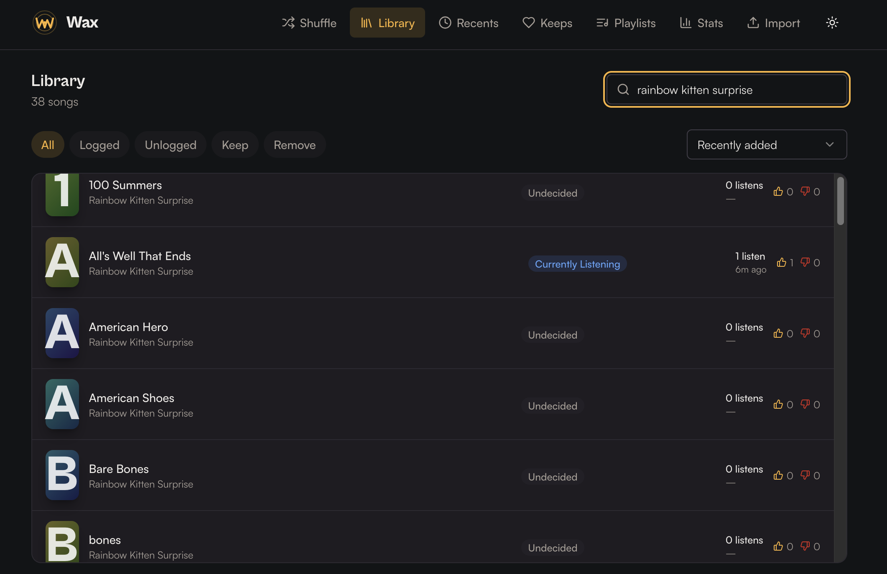

### 08. Recents timeline

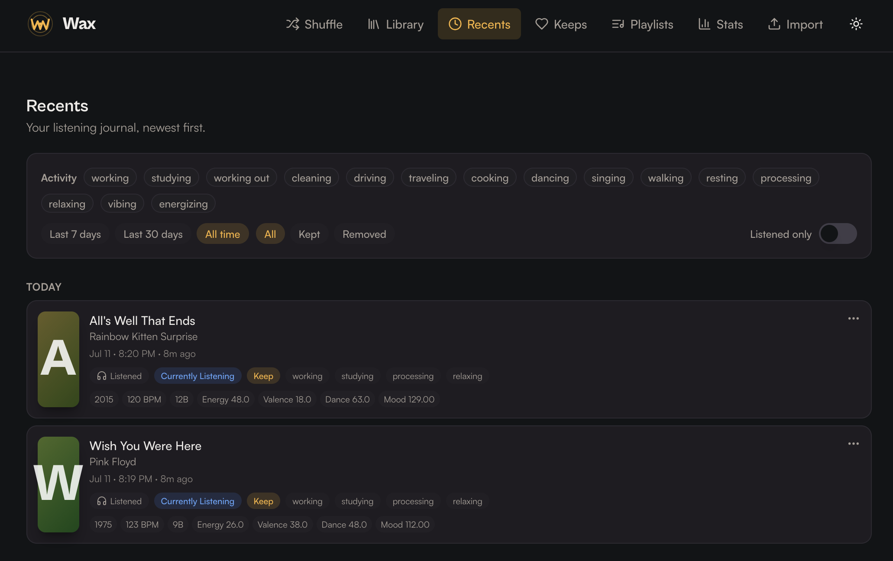

### 09. Keeps workspace

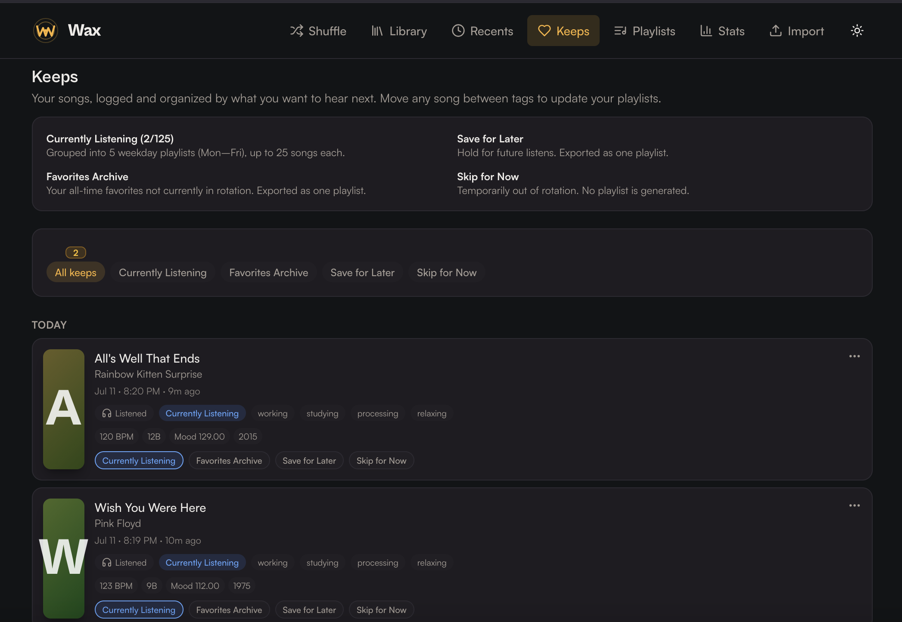

### 10. Playlists workspace

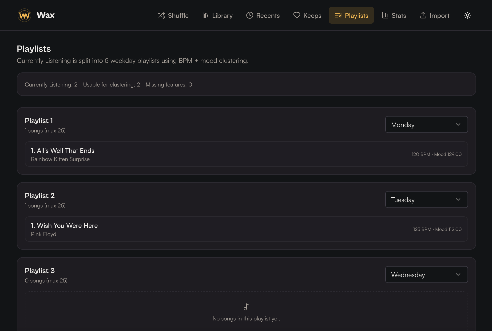

### 11. Stats dashboard

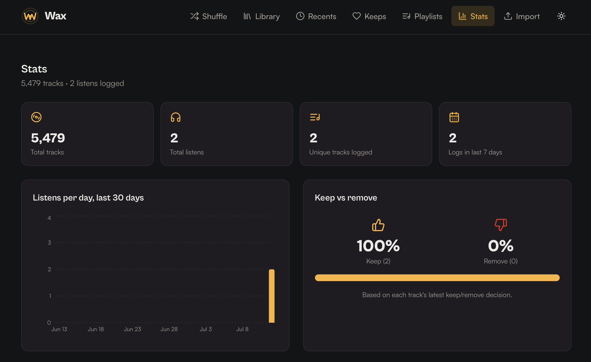

## Quick start

```bash
git clone https://github.com/kaseymallette/wax.git
cd wax
npm install
npm run dev

```

Then open **http://127.0.0.1:3000**.

### Import your music library

You can import a Spotify export (`.db`, `.sqlite`, or Exportify `.csv`) directly in the app.

If you need a playlist CSV from Spotify:

1. Build or open a playlist in Spotify.
2. Copy the playlist link.
3. Go to [Chosic Playlist Exporter](https://www.chosic.com/spotify-playlist-exporter/) and export as CSV.
4. Upload that CSV in Wax Import.

In Wax:

1. Open the app and go to the Import flow.
2. Upload your `.db`, `.sqlite`, or exported `.csv` file.
3. If prompted, map columns and complete import.

### Navigate the app

Wax lands on **Import** by default (`/`). The top nav order is **Import → Evaluate → Shuffle → Library → Recents → Keeps → Playlists → Stats**.

- Use **Import** to load your library CSV/DB.
- Use **Evaluate** to review a playlist CSV and apply keep/remove decisions in bulk.
- Use **Shuffle** for one-by-one listening decisions.
- Use **Library** to browse/search tracks and edit repeat-intent tags directly.
- Use **Recents** to review your latest logged decisions timeline.
- Use **Keeps** to manage all keep-tagged songs and move tracks between keep buckets.
- Use **Playlists** to inspect daily + intent playlists before Spotify push.
- Use **Stats** to view totals, activity trends, and tag distribution.

For full-song playback in the embed, sign into Spotify in any tab of the same browser. Premium plays the whole track; Free gives you 30-second previews.

### Playlists Algorithm

- Builds 7 daily playlists from `currently_listening` using k-means on BPM + mood (`energy + dance + valence`) with nearest-neighbor ordering.
- Uses dynamic per-playlist caps based on current `currently_listening` count:
  - `0–35` tracks → max `5` per playlist
  - `36–70` tracks → max `10` per playlist
  - `71–105` tracks → max `15` per playlist
  - `106–140` tracks → max `20` per playlist
  - `141–175` tracks → max `25` per playlist
  - `176+` tracks → max `30` per playlist
- Also writes one CSV each for `currently_listening`, `favorites_archive`, `save_for_later`, `skip_for_now`, and `full_music_library`.

## Spotify API playlists

1. Register a Spotify app in the [Spotify Developer Dashboard](https://developer.spotify.com/dashboard).
   - App name: `Wax`
   - App description: `WAX playlists`
   - Add redirect URI exactly: `http://127.0.0.1:8888/callback`
   - Enable **Web API** and save.

2. Copy the app credentials from Spotify app settings:
   - `Client ID`
   - `Client secret`

3. Create `.env` from the example and fill in credentials:

```bash
cp .env.example .env
```

```bash
SPOTIFY_CLIENT_ID=paste_your_client_id_here
SPOTIFY_CLIENT_SECRET=paste_your_client_secret_here
SPOTIFY_REDIRECT_URI=http://127.0.0.1:8888/callback
SPOTIFY_REFRESH_TOKEN=
WAX_USER=kasey
# or WAX_USER=kaseysdad
# or WAX_USER=kaseysmom
```

4. Authorize once to get a refresh token:

```bash
npm run spotify:auth
```

Copy the `SPOTIFY_REFRESH_TOKEN=...` line from terminal output into `.env`.

## Users

### Switch between users

This starts the app using that user's DB file (`users/<name>/music_library.db`).
Use this when you want to work in one person's library/decisions without touching another user's DB.

```bash
WAX_USER=kasey npm run dev:user
WAX_USER=kaseysdad npm run dev:user
WAX_USER=kaseysmom npm run dev:user
```

### Switch between profiles

This switches between different profiles for the same user. Each profile has its own set of playlists and settings.

```bash
WAX_USER=kasey-country-blues npm run dev:user
WAX_USER=kasey-pop-hip-hop npm run dev:user
```   

### Export decisions for each user

This writes the latest decisions from that user's DB (`users/<name>/music_library.db`) to
`users/<name>/decisions-latest.json` so it can be tracked in git/history.

```bash
WAX_USER=kasey npm run user:export
WAX_USER=kaseysdad npm run user:export
WAX_USER=kaseysmom npm run user:export
```

### Export decisions for each profile

This writes the latest decisions from that profile's DB (`users/<name>/<profile>/music_library.db`) to
`users/<name>/<profile>/decisions-latest.json` so it can be tracked in git/history.

```bash
WAX_USER=kasey-country-blues npm run user:export
WAX_USER=kasey-pop-hip-hop npm run user:export
```

### Build playlists for each user

This reads that user's DB (`users/<name>/music_library.db`) and generates playlist CSVs in
`users/<name>/playlists/`.

```bash
WAX_USER=kasey npm run user:playlists
WAX_USER=kaseysdad npm run user:playlists
WAX_USER=kaseysmom npm run user:playlists
```

### Build playlists for each profile

This reads that profile's DB (`users/<name>/<profile>/music_library.db`) and generates playlist CSVs in
`users/<name>/<profile>/playlists/`.

```bash
WAX_USER=kasey-country-blues npm run user:playlists
WAX_USER=kasey-pop-hip-hop npm run user:playlists
```

### Push playlists using Spotify API

If Spotify API is configured (`SPOTIFY_CLIENT_ID`, `SPOTIFY_CLIENT_SECRET`, `SPOTIFY_REFRESH_TOKEN`), push playlists to Spotify with:

Dry run: 
```bash
WAX_USER=kasey npm run spotify:push:dry
WAX_USER=kaseysdad npm run spotify:push:dry
WAX_USER=kaseysmom npm run spotify:push:dry
```

Push to Spotify: 
```bash
WAX_USER=kasey npm run spotify:push
WAX_USER=kaseysdad npm run spotify:push
WAX_USER=kaseysmom npm run spotify:push
```

### Push playlists for each profile

This pushes playlists for each profile to Spotify.

Dry run:
```bash
WAX_USER=kasey-country-blues npm run spotify:push:dry
WAX_USER=kasey-pop-hip-hop npm run spotify:push:dry
```

Push to Spotify:
```bash
WAX_USER=kasey-country-blues npm run spotify:push
WAX_USER=kasey-pop-hip-hop npm run spotify:push
```

### Save weekly snapshots for each user

This captures that user's weekly playlists into a user-specific snapshot DB, including unassigned tracks from `currently-listening.csv`.

```bash
WAX_USER=kasey npm run user:snapshots:weekly
WAX_USER=kaseysdad npm run user:snapshots:weekly
WAX_USER=kaseysmom npm run user:snapshots:weekly
```

This writes:

- `users/<user>/weekly-playlists.db`

### Save weekly playlists for profiles

This captures that profile's weekly playlists into a profile-specific snapshot DB, including unassigned tracks from `currently-listening.csv`.

```bash
WAX_USER=kasey-country-blues npm run user:snapshots:weekly
WAX_USER=kasey-pop-hip-hop npm run user:snapshots:weekly
```

This writes:

- `users/<user>/<profile>/weekly-playlists.db`

### Remove songs in each user DB

This deletes tracks marked with repeat intent `removed` from that user's DB (`users/<name>/music_library.db`).

```bash
WAX_USER=kasey npm run user:remove
WAX_USER=kaseysdad npm run user:remove
WAX_USER=kaseysmom npm run user:remove
```

### Check duplicate tracks in each user DB

This checks a user's `users/<name>/music_library.db` for duplicate artist+song groups and writes a per-user CSV report.

```bash
WAX_USER=kasey npm run user:dupes
WAX_USER=kaseysdad npm run user:dupes
WAX_USER=kaseysmom npm run user:dupes
```

This writes:

- `users/<user>/duplicate-tracks.csv`

### Back up user data

Each user DB (`users/<name>/music_library.db`) is local and not tracked in git. You can back up and restore a user's DB with:

```bash
WAX_USER=kasey npm run backup-db
WAX_USER=kasey npm run restore-db
WAX_USER=kaseysdad npm run backup-db
WAX_USER=kaseysdad npm run restore-db
WAX_USER=kaseysmom npm run backup-db
WAX_USER=kaseysmom npm run restore-db
```

## Support

### Troubleshooting

- **Port already in use** → `lsof -ti:3000 | xargs kill` then restart. Or run on a different port: `PORT=4000 npm run dev`.
- **macOS AirPlay grabbing port 5000** → use `PORT=3000` (default) or disable AirPlay Receiver in System Settings → General → AirDrop & Handoff.
- **`better-sqlite3` install fails** → needs a C++ toolchain. macOS: `xcode-select --install`. Ubuntu: `sudo apt install build-essential python3`. Node 22+ is recommended; Node 26 has no prebuilt binaries yet.
- **Old UI shows after pulling new code** → Vite cache: `rm -rf node_modules/.vite dist && npm run dev`, then hard-refresh the browser (Cmd+Shift+R).
- **Tracks show as "Unknown track" after CSV import** → your CSV's name column wasn't auto-detected. Wax recognizes `Song`, `Title`, `Track`, `Track Name`, `Song Name`. Rename your column or open an issue.
- **Lost data after rebuild** → your active DB is `users/<WAX_USER>/music_library.db` (default user is `kasey`). Don't delete it.

### Tech stack

Express · Vite · React · TypeScript · Tailwind · shadcn/ui · Drizzle ORM · better-sqlite3 · TanStack Query · framer-motion · Recharts · Fontshare (Cabinet Grotesk + Satoshi).

### License

MIT
