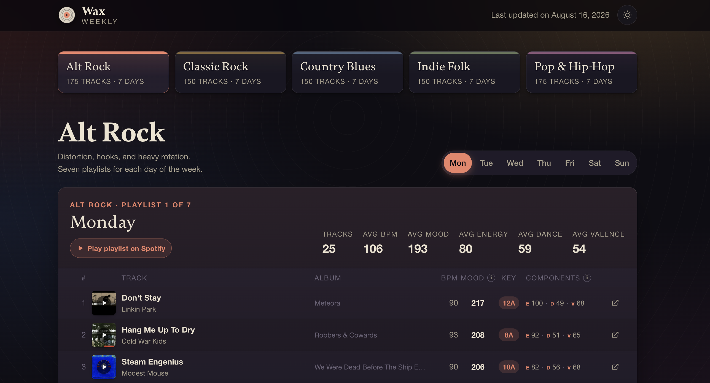
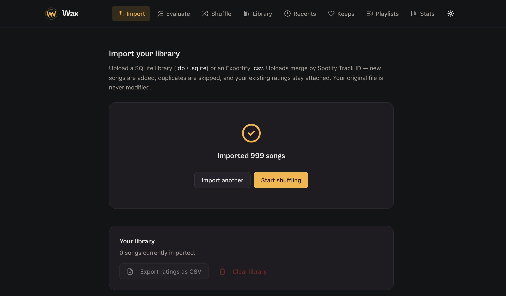
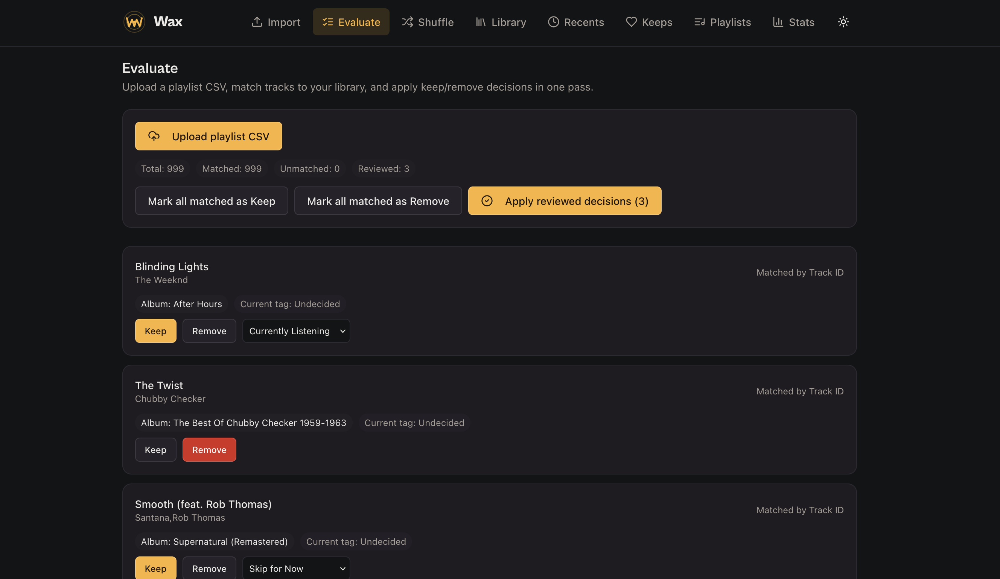
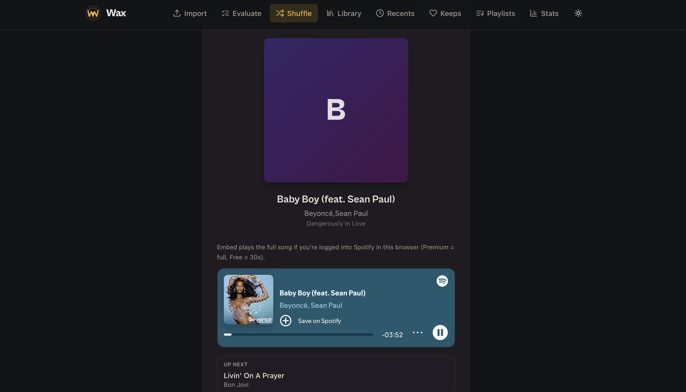
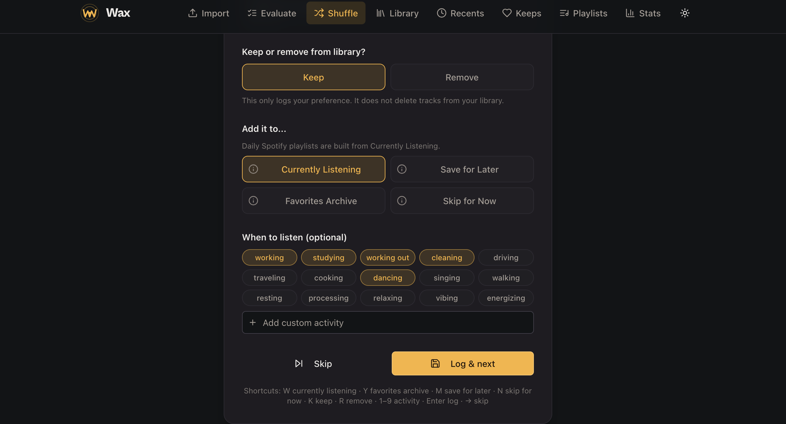
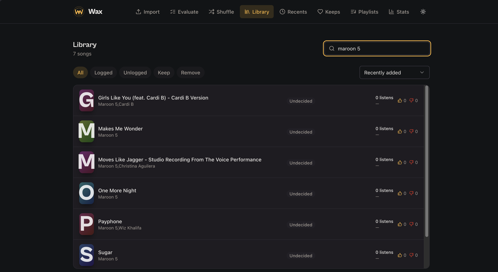
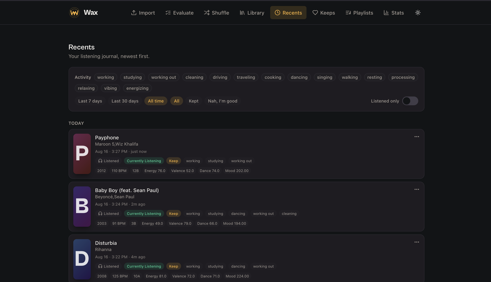
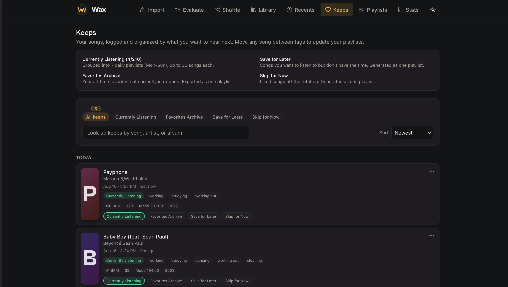
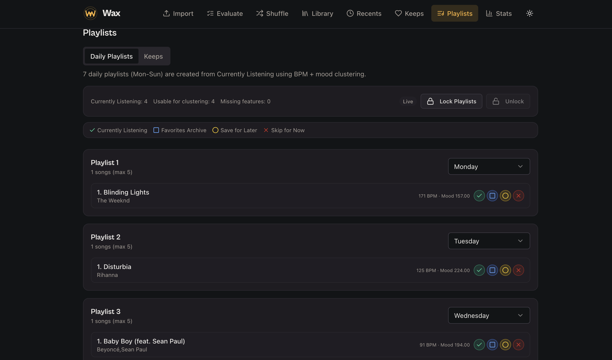
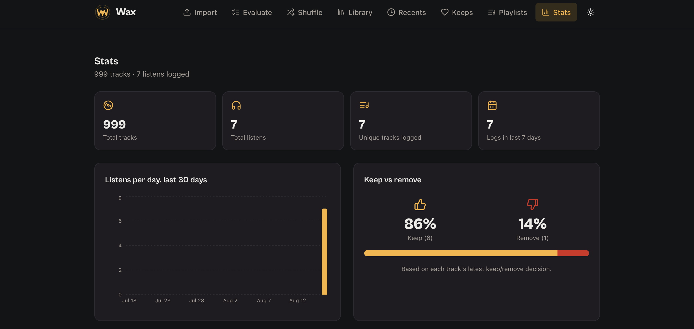

# Wax

Wax is a local-first music curation system built to turn a personally managed listening library into deliberate weekly rotation. It uses **K-means clustering on BPM and Mood**, where **Mood = Energy + Dance + Valence**, to distribute songs across daily playlists, **K-nearest neighbors** to sequence each playlist, and the **Spotify Web API** to publish the results.

[Wax Weekly](https://waxweekly.com) turns the Wax workflow into a weekly listening experience across five genre-bending profiles: **Alt Rock, Classic Rock, Country Blues, Indie Folk, and Pop & Hip-Hop**. Every song is curated by me, then distributed and sequenced using Wax.

## Introduction

Wax started with a simple frustration: **I wanted to listen to playlists on shuffle and hear every song.**

There is a real problem with random playback, and it's not just me who thinks they've heard the same song for the fourth time. In 2025, Spotify introduced **Fewer Repeats** after listeners reported that Shuffle felt repetitive, with certain songs and artists surfacing again and again. Spotify’s engineers attributed that experience to statistical randomness itself: a random sequence does not guarantee an even distribution, even when every track has an equal chance of appearing. [Spotify Engineering, “Shuffle: Making Random Feel More Human”](https://engineering.atspotify.com/2025/11/shuffle-making-random-feel-more-human). 

Given that I often shuffled my entire Liked Songs library, which contained thousands of songs, making it through a complete random sequence was nearly impossible. I would search for a song, switch playlists, change genres, or navigate somewhere else, replacing the queue before the sequence ever finished. The next time I hit Shuffle, songs I had already heard had another chance of landing near the front of the queue.

So I started making smaller playlists. Even then, I noticed that not every song appeared in the playback queue when I hit Shuffle. **Fewer Repeats** generates several random versions of a playlist, then uses listening history to choose which sequence to play. I wanted something simpler: **a guarantee that every song I selected would make it into the rotation.** With access to more music than anyone can realistically listen to, discovery is only half the problem. The real challenge is keeping great songs from disappearing back into an endless library.

Instead of generating another random order, I wanted to know that the songs in my active listening library were being **deliberately distributed across the week.** I wanted repetition, because I like hearing songs again. I wanted novelty, because I did not want to hear the same subset constantly. And I wanted the individual playlists to have enough musical continuity that they still felt good to listen to from beginning to end.

**So I built my own system.**

## Methods

### Managing the Listening Pool

I built a local application to manage my music database and CSV files containing track metadata and audio-feature data. Songs can be moved between four states depending on how I currently want to listen to them:

- **Currently Listening** — songs included in active playlist generation
- **Favorites / Archive** — songs I want to keep but remove from the current rotation
- **Skip for Now** — songs temporarily removed from rotation
- **Save for Later** — songs I want to revisit

This keeps the curation itself human-in-the-loop: I decide which songs belong in the active listening pool.

### Playlist Generation

For each genre collection, I used two dimensions to organize the active listening pool: **BPM** and **Mood**.

Mood is a composite score calculated from three audio features:

`Mood = Energy + Danceability + Valence`

I used **K-means clustering** on BPM and Mood to divide the active listening pool into equal-sized daily playlists. This gives every selected song a place in the weekly rotation while grouping tracks with similar musical characteristics.

### Playlist Sequencing

For each playlist, I begin with the track that has the highest Mood score. I then use **K-nearest neighbors** in BPM-Mood space to move from that track to the nearest remaining track, repeating the process until the entire playlist has been ordered.

In other words, **K-means determines which songs belong together; K-nearest neighbors determines how they flow from one song to the next.**

### Publishing to Spotify

Once the playlists have been clustered and ordered, I create the daily playlists programmatically using the **Spotify Web API**.

Spotify remains the playback platform, but Wax determines which songs are in the rotation, how they are distributed across the week, and the order in which to play them.

### Custom Web Interface

After generating the playlists, I built a custom web interface to showcase the weekly output across five genre-bending collections: **Alt Rock, Classic Rock, Country Blues, Indie Folk, and Pop & Hip-Hop**.

Built from scratch using **HTML, CSS, and JavaScript**, the site provides an interactive interface for navigating each genre and day of the week, viewing playlist statistics and track metadata, previewing songs through Spotify, and opening tracks directly in Spotify.

## Results

### Wax Weekly



[Wax Weekly](https://waxweekly.com) is the public listening experience built from Wax.

The current collection includes 800 tracks across five genre-bending profiles, with daily playlists of 20-25 songs for each profile: **Alt Rock, Classic Rock, Country Blues, Indie Folk, and Pop & Hip-Hop**. 

The site is deployed through Cloudflare Pages from the `wax_weekly/` directory in this repository and hosted on my custom domain.

**Live site:** [waxweekly.com](https://waxweekly.com)  
**Source:** [`wax_weekly/`](https://github.com/kaseymallette/wax/tree/main/wax_weekly)  
**Curated by:** Kasey Mallette

### Wax Weekly directory

```text
wax_weekly/
├── index.html    # Page structure and metadata
├── base.css      # Base styles
├── style.css     # Wax Weekly interface and responsive styles
├── app.js        # Playlist rendering and interaction
├── data.js       # Playlist and track data
├── art.js        # Album artwork cache
└── _headers      # Cloudflare cache-control headers
```

Refresh `wax_weekly/data.js` + `wax_weekly/art.js` from weekly snapshot DBs (latest available snapshot per public station):

```bash
npm run weekly:site:build
```

Optional: force a specific week start (UTC Monday):

```bash
WAX_WEEKLY_WEEK_START=2026-08-31 npm run weekly:site:build
```

### Local Wax App Walkthrough

> The screenshots below are from the `test` user, using a 999-song playlist import from `Billboards_Greatest_Hits_of_All_Time.csv`.

**01. Run dev**


**02. Import library**



**03. Evaluate playlist**



**04. Shuffle Preview Song**



**05. Shuffle Keep or Remove**



**06. Search Library**



**07. Recents**



**08. Keeps**



**09. Daily playlists**



**10. Stats**



## Quick start

```bash
git clone https://github.com/kaseymallette/wax.git
cd wax
npm install
npm run dev
```

Then open **http://127.0.0.1:3000**.

### Import your music library

You can import a Spotify export (`.db`, `.sqlite`, or Exportify `.csv`) directly in the app.

If you need a playlist CSV from Spotify:

1. Build or open a playlist in Spotify.
2. Copy the playlist link.
3. Go to [Chosic Playlist Exporter](https://www.chosic.com/spotify-playlist-exporter/) and export as CSV.
4. Upload that CSV in Wax Import.

In Wax:

1. Open the app and go to the Import flow.
2. Upload your `.db`, `.sqlite`, or exported `.csv` file.
3. If prompted, map columns and complete import.

### Navigate the app

Wax lands on **Import** by default (`/`). The top nav order is **Import → Evaluate → Shuffle → Library → Recents → Keeps → Playlists → Stats**.

- Use **Import** to load your library CSV/DB.
- Use **Evaluate** to review a playlist CSV and apply keep/remove decisions in bulk.
- Use **Shuffle** for one-by-one listening decisions.
- Use **Library** to browse/search tracks and edit repeat-intent tags directly.
- Use **Recents** to review your latest logged decisions timeline.
- Use **Keeps** to manage all keep-tagged songs and move tracks between keep buckets.
- Use **Playlists** to inspect daily + intent playlists before Spotify push.
- Use **Stats** to view totals, activity trends, and tag distribution.

For full-song playback in the embed, sign into Spotify in any tab of the same browser. Premium plays the whole track; Free gives you 30-second previews.

### Playlists Algorithm

- Builds 7 daily playlists from `currently_listening` using k-means on BPM + mood (`energy + dance + valence`) with nearest-neighbor ordering.
- Uses dynamic per-playlist caps based on current `currently_listening` count:
  - `0–35` tracks → max `5` per playlist
  - `36–70` tracks → max `10` per playlist
  - `71–105` tracks → max `15` per playlist
  - `106–140` tracks → max `20` per playlist
  - `141–175` tracks → max `25` per playlist
  - `176+` tracks → max `30` per playlist
- Also writes one CSV each for `currently_listening`, `favorites_archive`, `save_for_later`, `skip_for_now`, and `full_music_library`.

## Spotify API playlists

1. Register a Spotify app in the [Spotify Developer Dashboard](https://developer.spotify.com/dashboard).
   - App name: `Wax`
   - App description: `WAX playlists`
   - Add redirect URI exactly: `http://127.0.0.1:8888/callback`
   - Enable **Web API** and save.

2. Copy the app credentials from Spotify app settings:
   - `Client ID`
   - `Client secret`

3. Create `.env` from the example and fill in credentials:

```bash
cp .env.example .env
```

```bash
SPOTIFY_CLIENT_ID=paste_your_client_id_here
SPOTIFY_CLIENT_SECRET=paste_your_client_secret_here
SPOTIFY_REDIRECT_URI=http://127.0.0.1:8888/callback
SPOTIFY_REFRESH_TOKEN=
WAX_USER=kasey
# or WAX_USER=kaseysdad
# or WAX_USER=kaseysmom
```

4. Authorize once to get a refresh token:

```bash
npm run spotify:auth
```

Copy the `SPOTIFY_REFRESH_TOKEN=...` line from terminal output into `.env`.

## Users

### Switch between users

This starts the app using that user's DB file (`users/<name>/music_library.db`).
Use this when you want to work in one person's library/decisions without touching another user's DB.

```bash
WAX_USER=kasey npm run dev:user
WAX_USER=kaseysdad npm run dev:user
WAX_USER=kaseysmom npm run dev:user
```

### Switch between profiles

This switches between different profiles for the same user. Each profile has its own set of playlists and settings.

```bash
WAX_USER=kasey-alt-rock npm run dev:user
WAX_USER=kasey-classic-rock npm run dev:user
WAX_USER=kasey-country-blues npm run dev:user
WAX_USER=kasey-indie-folk npm run dev:user
WAX_USER=kasey-pop-hip-hop npm run dev:user


```   

### Export decisions for each user

This writes the latest decisions from that user's DB (`users/<name>/music_library.db`) to
`users/<name>/decisions-latest.json` so it can be tracked in git/history.

```bash
WAX_USER=kasey npm run user:export
WAX_USER=kaseysdad npm run user:export
WAX_USER=kaseysmom npm run user:export
```

### Export decisions for each profile

This writes the latest decisions from that profile's DB (`users/<name>/<profile>/music_library.db`) to
`users/<name>/<profile>/decisions-latest.json` so it can be tracked in git/history.

```bash
WAX_USER=kasey-alt-rock npm run user:export
WAX_USER=kasey-classic-rock npm run user:export
WAX_USER=kasey-country-blues npm run user:export
WAX_USER=kasey-indie-folk npm run user:export
WAX_USER=kasey-pop-hip-hop npm run user:export
```

### Build playlists for each user

This reads that user's DB (`users/<name>/music_library.db`) and generates playlist CSVs in
`users/<name>/playlists/`.

```bash
WAX_USER=kasey npm run user:playlists
WAX_USER=kaseysdad npm run user:playlists
WAX_USER=kaseysmom npm run user:playlists
```

### Build playlists for each profile

This reads that profile's DB (`users/<name>/<profile>/music_library.db`) and generates playlist CSVs in
`users/<name>/<profile>/playlists/`.

```bash
WAX_USER=kasey-alt-rock npm run user:playlists
WAX_USER=kasey-classic-rock npm run user:playlists
WAX_USER=kasey-country-blues npm run user:playlists
WAX_USER=kasey-indie-folk npm run user:playlists
WAX_USER=kasey-pop-hip-hop npm run user:playlists
```

### Push playlists using Spotify API

If Spotify API is configured (`SPOTIFY_CLIENT_ID`, `SPOTIFY_CLIENT_SECRET`, `SPOTIFY_REFRESH_TOKEN`), push playlists to Spotify with:

Dry run: 
```bash
WAX_USER=kasey npm run spotify:push:dry
WAX_USER=kaseysdad npm run spotify:push:dry
WAX_USER=kaseysmom npm run spotify:push:dry
```

Push to Spotify: 
```bash
WAX_USER=kasey npm run spotify:push
WAX_USER=kaseysdad npm run spotify:push
WAX_USER=kaseysmom npm run spotify:push
```

### Push playlists for each profile

This pushes playlists for each profile to Spotify.

Dry run:
```bash
WAX_USER=kasey-alt-rock npm run spotify:push:dry
WAX_USER=kasey-classic-rock npm run spotify:push:dry
WAX_USER=kasey-country-blues npm run spotify:push:dry
WAX_USER=kasey-indie-folk npm run spotify:push:dry
WAX_USER=kasey-pop-hip-hop npm run spotify:push:dry
```

Push to Spotify:
```bash
WAX_USER=kasey-alt-rock npm run spotify:push
WAX_USER=kasey-classic-rock npm run spotify:push
WAX_USER=kasey-country-blues npm run spotify:push
WAX_USER=kasey-indie-folk npm run spotify:push
WAX_USER=kasey-pop-hip-hop npm run spotify:push
```

### Save weekly snapshots for each user

This captures that user's weekly playlists into a user-specific snapshot DB, including unassigned tracks from `currently-listening.csv`.

```bash
WAX_USER=kasey npm run user:snapshots:weekly
WAX_USER=kaseysdad npm run user:snapshots:weekly
WAX_USER=kaseysmom npm run user:snapshots:weekly
```

This writes:

- `users/<user>/weekly-playlists.db`

### Save weekly playlists for profiles

This captures that profile's weekly playlists into a profile-specific snapshot DB, including unassigned tracks from `currently-listening.csv`.

```bash
WAX_USER=kasey-alt-rock npm run user:snapshots:weekly
WAX_USER=kasey-classic-rock npm run user:snapshots:weekly
WAX_USER=kasey-country-blues npm run user:snapshots:weekly
WAX_USER=kasey-indie-folk npm run user:snapshots:weekly
WAX_USER=kasey-pop-hip-hop npm run user:snapshots:weekly
```

This writes:

- `users/<user>/<profile>/weekly-playlists.db`

### Remove songs in each user DB

This deletes tracks marked with repeat intent `removed` from that user's DB (`users/<name>/music_library.db`).

```bash
WAX_USER=kasey npm run user:remove
WAX_USER=kaseysdad npm run user:remove
WAX_USER=kaseysmom npm run user:remove
```

### Check duplicate tracks in each user DB

This checks a user's `users/<name>/music_library.db` for duplicate artist+song groups and writes a per-user CSV report.

```bash
WAX_USER=kasey npm run user:dupes
WAX_USER=kaseysdad npm run user:dupes
WAX_USER=kaseysmom npm run user:dupes
```

This writes:

- `users/<user>/duplicate-tracks.csv`

### Back up user data

Each user DB (`users/<name>/music_library.db`) is local and not tracked in git. You can back up and restore a user's DB with:

```bash
WAX_USER=kasey npm run backup-db
WAX_USER=kasey npm run restore-db
WAX_USER=kaseysdad npm run backup-db
WAX_USER=kaseysdad npm run restore-db
WAX_USER=kaseysmom npm run backup-db
WAX_USER=kaseysmom npm run restore-db
```

## Support

### Troubleshooting

- **Port already in use** → `lsof -ti:3000 | xargs kill` then restart. Or run on a different port: `PORT=4000 npm run dev`.
- **macOS AirPlay grabbing port 5000** → use `PORT=3000` (default) or disable AirPlay Receiver in System Settings → General → AirDrop & Handoff.
- **`better-sqlite3` install fails** → needs a C++ toolchain. macOS: `xcode-select --install`. Ubuntu: `sudo apt install build-essential python3`. Node 22+ is recommended; Node 26 has no prebuilt binaries yet.
- **Old UI shows after pulling new code** → Vite cache: `rm -rf node_modules/.vite dist && npm run dev`, then hard-refresh the browser (Cmd+Shift+R).
- **Tracks show as "Unknown track" after CSV import** → your CSV's name column wasn't auto-detected. Wax recognizes `Song`, `Title`, `Track`, `Track Name`, `Song Name`. Rename your column or open an issue.
- **Lost data after rebuild** → your active DB is `users/<WAX_USER>/music_library.db` (default user is `kasey`). Don't delete it.

### Tech stack

Express · Vite · React · TypeScript · Tailwind · shadcn/ui · Drizzle ORM · better-sqlite3 · TanStack Query · framer-motion · Recharts · Fontshare (Cabinet Grotesk + Satoshi).

### License

MIT
