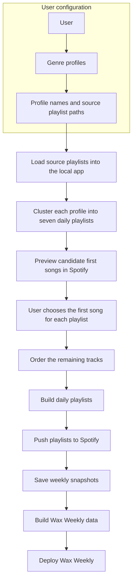

# Wax V2

Wax is a local-first music curation system that turns a user's genre-based listening profiles into deliberate daily playlists.

[Wax Weekly](https://waxweekly.com) is the public listening experience built from Wax's weekly output.

## V2

V2 moves daily playlist generation to a user-level workflow. Instead of running Wax separately for every genre, a user defines their genre profiles and source playlist paths once. The local app processes every configured profile in a single run.

Each profile still produces seven daily playlists. Wax clusters the tracks, lets the user preview and choose the first song for each day, orders the remaining tracks, publishes the playlists to Spotify, and creates the weekly data used by Wax Weekly.

## Playlist method

Wax uses two dimensions to organize each profile's active listening pool:

- **BPM**
- **Mood**, calculated as `Energy + Danceability + Valence`

**K-means** distributes tracks across the seven daily playlists. After the user chooses the opening track for each playlist, **K-nearest neighbors** orders the remaining tracks in BPM-Mood space.

K-means determines which songs belong together. The user's first-song choice sets the entry point. K-nearest neighbors determines how the playlist flows from there.

## System boundaries

| Component | Responsibility |
| --- | --- |
| User configuration | Defines the user's genre profiles and the source path for each profile |
| Wax local app | Manages the listening pool, generates daily playlists, and supports first-song selection |
| Spotify | Provides track previews and hosts the published playlists |
| Weekly snapshots | Preserve the generated playlists for a specific week |
| Wax Weekly | Turns the latest snapshots into the public web experience |

## Example profile set

A user can configure any number of profiles. The current Wax Weekly collection uses:

- Alt Rock
- Classic Rock
- Country Blues
- Indie Folk
- Pop & Hip-Hop

## Design principle

Wax remains human-in-the-loop. The system handles distribution, sequencing, publishing, and deployment data; the user controls the listening pool, genre profiles, and the first song that establishes each playlist's direction.

**Live site:** [waxweekly.com](https://waxweekly.com)  
**Curated by:** Kasey Mallette
