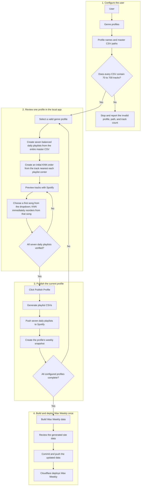

# Wax V2

Wax is a local-first playlist generation system that turns user-maintained genre playlists into deliberate daily playlists.

[Wax Weekly](https://waxweekly.com) is the public listening experience built from Wax's weekly output.

## V2

V2 moves daily playlist generation to a user-level workflow. A user defines any number of genre profiles and provides the path to one master CSV playlist for each profile. The CSV is the authoritative music source for that profile; Wax does not maintain a separate music library or classify songs into listening states.

After the full configuration passes validation, one local app session provides access to every profile while preserving a one-profile-at-a-time workflow. Each profile produces seven daily playlists. Wax creates an initial playlist order from the track nearest each playlist's center. The user can then preview tracks and choose a different first song from a dropdown; that choice immediately recalculates the nearest-neighbor order. After verifying the current profile, the user can publish it and create its weekly snapshot without leaving the local app. Wax Weekly data is built once, only after every configured profile has a completed snapshot.

## V2 scope

V2 intentionally removes the V1 library-management workflow. It does not include a persistent Wax music library, `currently_listening`, `favorites_archive`, `save_for_later`, `skip_for_now`, repeat-intent decisions, or the Import, Evaluate, Shuffle, Library, Recents, Keeps, and Stats interfaces.

The V2 local app is limited to profile navigation, playlist generation, Spotify preview, first-song selection, per-profile publishing, weekly snapshots, and the final Wax Weekly build. Source playlists are provided through local CSV paths for now. Direct Spotify source-playlist integration may be added later; Spotify remains the preview and publishing platform in V2.

## Playlist method

Each configured CSV is the complete master playlist for one genre profile. Wax uses two dimensions to organize its tracks:

- **BPM**
- **Mood**, a cumulative score calculated as `Energy + Danceability + Valence`

Energy, Danceability, and Valence are each scored from `0–100`, so Mood ranges from `0–300`. Wax creates seven clusters in BPM-Mood space using `k = 7`, with balanced assignment enforced during clustering.

Every profile CSV must contain between 70 and 700 tracks. Wax validates all configured CSVs before the playlist workflow begins. If any CSV falls outside that range, validation stops and reports the profile name, path, actual track count, and required range.

Wax does not truncate, repair, archive, or automatically split an invalid playlist. The user must edit the source playlist or create another profile, update the CSV configuration, and try again. Every track from a valid CSV is used; there is no separate tiered cap on the generated daily playlists.

For `n` tracks in a valid master CSV:

- `q = floor(n / 7)`
- `r = n mod 7`
- `r` playlists receive `q + 1` tracks.
- The remaining `7 - r` playlists receive `q` tracks.

This produces seven playlists whose sizes differ by at most one track. A 70-track profile produces seven 10-track playlists; a 700-track profile produces seven 100-track playlists. For totals that are not divisible by seven, every track is still assigned: 193 tracks become four 28-track playlists and three 27-track playlists.

Balanced assignment is part of the clustering logic, not a display limit applied afterward. Track assignment must preserve musical similarity while meeting these target playlist sizes.

**K-nearest neighbors** creates the initial sequence within each daily playlist, beginning with the track nearest the playlist center.

When the user chooses a different opening track from the dropdown, Wax immediately reruns the K-nearest-neighbor sequence from that selection. Choosing the first song and recalculating the playlist order are one interaction, not separate pipeline stages.

K-means determines which songs belong together. The selected first song sets the entry point. K-nearest neighbors determines how the playlist flows from there.

## System boundaries

| Component | Responsibility |
| --- | --- |
| User configuration | Defines any number of genre profiles and the master CSV path for each profile |
| Master profile CSV | Acts as the complete and authoritative music source for one profile; must contain 70–700 tracks |
| Wax local app | Validates configuration and provides profile navigation, playlist review, first-song selection, and the per-profile publish action |
| Spotify | Provides track previews and hosts the published playlists |
| Weekly snapshots | Preserve each profile's generated playlists for a specific week |
| Wax Weekly build | Runs once after every profile snapshot is complete and creates the shared site data |
| Wax Weekly deployment | Occurs when the updated site data is committed and pushed |

## Example profile set

A user can configure any number of profiles. The current Wax Weekly collection uses:

- Alt Rock
- Classic Rock
- Country Blues
- Indie Folk
- Pop & Hip-Hop

## Design principle

Wax remains human-in-the-loop without becoming a music-library maintenance system. The user maintains each master playlist outside Wax. Wax validates and transforms that playlist into a weekly rotation, then supports review and publishing one profile at a time. Per-profile publishing pauses until all seven daily playlists are verified, and the Wax Weekly build pauses until every configured profile has a completed weekly snapshot.

**Live site:** [waxweekly.com](https://waxweekly.com)  
**Curated by:** Kasey Mallette
